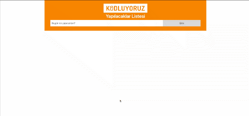

# To Do Js App

#### By Egemen Kar

## Preview

## Description

It's the second assignment of Patika JavaScript curriculum.

It's a to-do app. With this app you can add, complete and delete tasks. It stores your tasks on local storage. 

HTML, CSS, JS, jquery and Bootstrap is used.

## Setup/Installation Requirements & License etc.

Check the main [README](../README.md)
